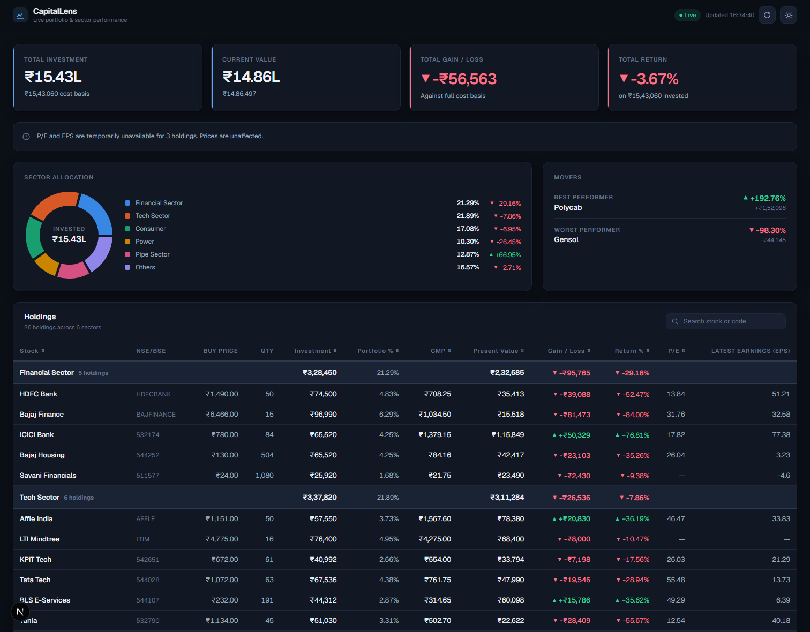
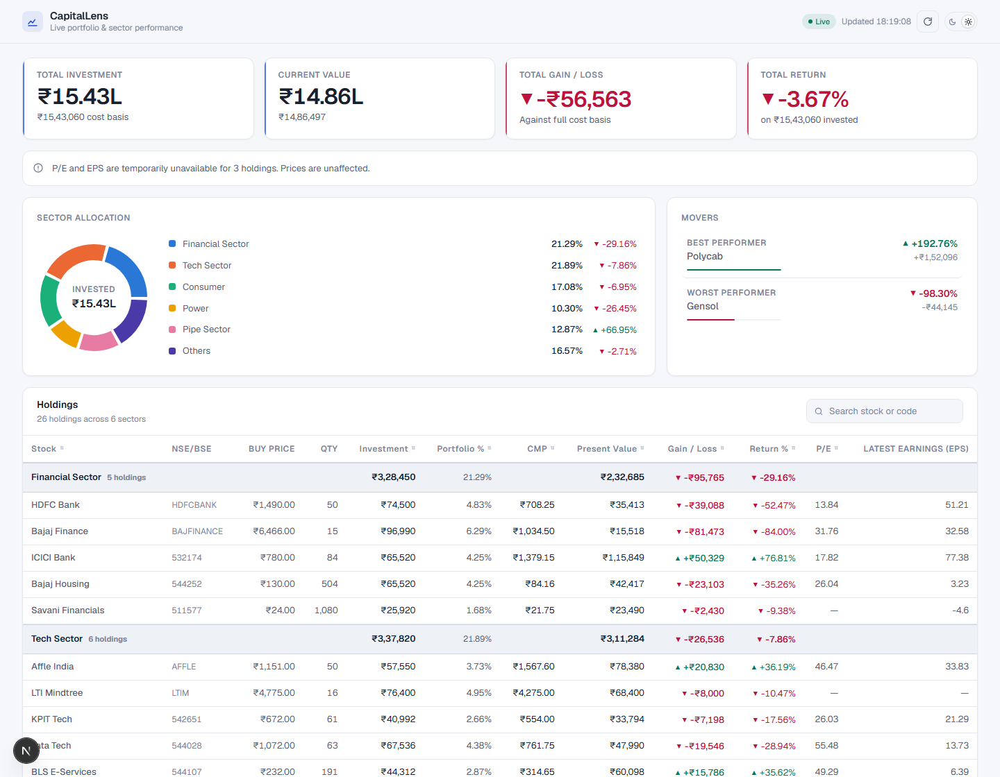

# CapitalLens

A full-stack portfolio dashboard. It takes a fixed set of 26 holdings, enriches them server-side with
live market prices from Yahoo Finance and fundamentals from Google Finance, computes portfolio and
sector performance, and refreshes the price-derived figures roughly every 15 seconds.



<details>
<summary>Light theme</summary>



</details>

---

## Stack

| Layer | Choice |
|---|---|
| Framework | Next.js 16 (App Router) |
| Language | TypeScript (strict) |
| UI | React 19, Tailwind CSS v4 |
| Chart | Recharts |
| HTML parsing | Cheerio |
| Tests | Vitest |

No database, no authentication, no Redis, no WebSockets. The backend is a single Next.js route
handler.

## Getting started

```bash
npm install
npm run dev
```

Open <http://localhost:3000>. Node 20 or newer is required (Node 24 was used in development).

No environment variables or API keys are needed. Both data sources are public endpoints.

### Scripts

```bash
npm run dev        # development server
npm run build      # production build
npm start          # serve the production build
npm run lint       # ESLint
npm run typecheck  # tsc --noEmit
npm test           # Vitest (no network access required)
```

## Data flow

```
data/holdings.ts  (26 holdings, normalized from the source workbook)
        │
        ▼
GET /api/portfolio ────┬──> Yahoo Finance  → CMP              (15s cache)
        │              └──> Google Finance → P/E, EPS         (45min cache)
        │
        ├──> calculations   investment, present value, gain/loss
        ├──> aggregation    sector rollups, portfolio totals, coverage
        │
        ▼
   normalized JSON
        │
        ▼
usePortfolio() → dashboard (polls every 15s)
```

A single request traces end to end: a row in `data/holdings.ts` → a symbol lookup in the provider
adapter → a normalized quote → a pure calculation → a sector aggregate → a field in the API response
→ a table cell.

### Key files

| Path | Responsibility |
|---|---|
| `data/holdings.ts` | The 26 holdings and their verified provider symbols |
| `lib/finance/yahoo-provider.ts` | Yahoo adapter, quote validation, caching |
| `lib/finance/google-finance-provider.ts` | Google scraping and HTML parsing |
| `lib/portfolio/calculations.ts` | Pure, null-safe arithmetic |
| `lib/portfolio/aggregate.ts` | Sector and portfolio rollups |
| `lib/portfolio/build.ts` | Composes everything into the API payload |
| `app/api/portfolio/route.ts` | The only backend endpoint |
| `hooks/usePortfolio.ts` | Polling, in-flight guarding, visibility handling |

## Data sources

**Prices — Yahoo Finance.** Fetched server-side from the unauthenticated
`v8/finance/chart` endpoint. The more commonly used `v7/finance/quote` endpoint now returns HTTP 401
without a cookie and crumb handshake, so it is not used.

**Fundamentals — Google Finance.** Google publishes no official API for P/E and EPS, so the quote
page is fetched server-side and parsed with Cheerio. The parser matches the visible label text
("P/E ratio", "EPS") rather than Google's obfuscated CSS class names, which change without notice.

The browser never contacts either provider directly, and no upstream HTML is ever sent to the client.

The workbook labels this column "Latest Earnings" and populates it from Google Finance's EPS, so the
dashboard shows it as **Latest Earnings (EPS)**.

## Refresh policy

| Data | Cadence | Why |
|---|---|---|
| Prices (CMP) | ~15 seconds | Required by the assignment; drives present value, gain/loss and totals |
| P/E and EPS | 45 minutes | These move on quarterly earnings. Scraping them every 15 seconds would be ~180× the requests for no new information, and a fast route to being rate-limited |

Polling never overlaps itself: the next request is scheduled after the previous one completes, not on
a fixed timer. It also suspends entirely while the browser tab is hidden and resumes on return.

## Partial data

The dashboard is explicit about what it can and cannot value.

An unavailable price produces `null`, never `0`. Portfolio and sector returns are calculated over the
**priced subset only** — gain/loss subtracts `pricedInvestment` rather than the full cost basis — so
holdings that could not be priced are never silently reported as a total loss. The API exposes
`pricedHoldingsCount`, `valuationCoveragePct` and a `completeness` flag, and the UI states the
coverage in plain language whenever it is not complete.

If a provider call fails but a previous value is cached, that value is shown and clearly marked
stale. Missing values render as `—`. The page never displays `NaN`, `Infinity` or `undefined`.

A total provider outage still returns HTTP 200 with the holdings, cost basis and any working
fundamentals intact.

## Known limitations

- **Both integrations are unofficial.** Yahoo's chart endpoint and Google Finance's HTML are not
  public APIs. They can change shape, rate-limit, or block without notice. The app degrades to
  `—` rather than breaking, but the data can stop flowing.
- **Scraping is inherently fragile.** If Google restructures its quote page, P/E and EPS return
  `null` until the parser is updated.
- **Some fundamentals are simply absent upstream.** Google publishes no P/E or EPS for three of the
  26 holdings today (including Gensol, which is loss-making and therefore has no meaningful P/E).
  That is missing source data, not a parser failure.
- **The cache is in-process.** On a serverless platform it is per-instance and resets on cold start,
  so the effective hit rate is lower than it is locally. Redis would be the production fix; it is
  deliberately not introduced here.
- **The holdings are a fixed snapshot** and are not brokerage-accurate. See below.

### Source snapshot and corporate actions

The quantities and purchase prices come from the supplied workbook and are reproduced exactly. They
are **not** adjusted for anything that happened after the snapshot was taken, because the workbook
contains no transaction dates and any adjustment would be guesswork.

This matters when reading the numbers: corporate actions after the snapshot date — bonuses, splits,
mergers, renames — change the real quantity or cost basis of a position. HDFC Bank's bonus issue and
the LTIMindtree → LTM rename both fall in this window. Pairing a historical cost basis with today's
market price is therefore **illustrative of the calculation**, not a true position P&L. A real
brokerage view would need the transaction history.

## Deployment

The app deploys to any Node host with no configuration and no environment variables:

```bash
npm run build
npm start
```

### Vercel

Vercel needs nothing beyond importing the repository — framework detection, build command and
output are all automatic. Nothing else (a separate backend, a container host, a worker) is required:
the entire server side is one Next.js route handler.

Three things are worth knowing before deploying:

- **Function timeout.** A cold request fans out to 26 Yahoo quotes and 26 Google Finance pages and
  takes ~20 seconds; warm requests settle to ~3s. The platform default of 10s would 504 on the first
  request after every cold start, so `app/api/portfolio/route.ts` sets `maxDuration = 60`.
- **Cache resets on cold start.** The TTL cache is in process memory, so a scaled-to-zero deployment
  re-fetches far more often than a long-running server does — including the 45-minute fundamentals
  scrape. Redis is the production fix and is deliberately out of scope here.
- **Providers may block datacentre IPs.** Yahoo's chart endpoint and Google Finance are unofficial
  and are markedly more likely to rate-limit or block a cloud IP range than a residential one. The
  dashboard degrades honestly if that happens — cost basis intact, a "Prices unavailable" status and
  em-dashes rather than invented numbers — but a deployed demo can legitimately show less live data
  than the same code does locally. If prices stop resolving after deploying, check this first.

## Documentation

`TECHNICAL_NOTES.md` covers the architecture and the engineering decisions in more depth.
